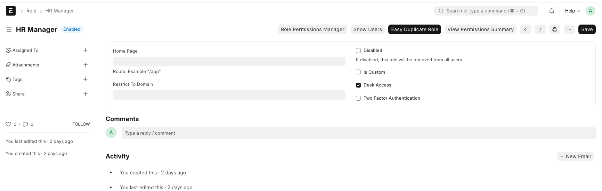

# Easy Duplicate Role

A comprehensive role duplication system for Frappe applications that allows you to easily duplicate roles with all their permissions, user permissions, and settings.

## Features

- **🔄 Complete Role Duplication**: Clone roles with all permissions, settings, and configurations
- **👥 User Permission Cloning**: Duplicate user-specific permissions and restrictions
- **🎯 Smart Permission Management**: Automatically handles complex permission structures
- **🔍 Real-time Validation**: Prevents duplicate role names and validates permissions
- **📊 Detailed Reporting**: Shows comprehensive results with success/failure counts
- **🖥️ Multiple Interfaces**: Web interface, form buttons, and programmatic access

## Quick Start

### 1. Role Duplication

#### Using the Role Form
1. Navigate to any **Role** document (e.g., HR Manager, Delivery Manager)
2. Click the **"Easy Duplicate Role"** button in the toolbar
3. Enter the new role name
4. The system will create a complete copy with all permissions



#### Using the Role Duplicate DocType
1. Go to **Role Duplicate** list
2. Create a new **Role Duplicate** document
3. Select the **Source Role** (e.g., "Delivery Manager")
4. Enter the **New Role Name** (e.g., "Delivery Manager Copy")
5. Click **"Load Permissions"** to preview all permissions
6. Click **"Create New Role"** to complete the duplication


### 2. User Permission Management

#### Using User Permission Manager
1. Navigate to **User Permission Manager**
2. Create a new document with:
   - **Alias Name**: Friendly identifier
   - **Applied User**: Target user email
3. Add permission details in the **User Permission Details** table:
   - **Allow**: Document type (e.g., Customer Group, Warehouse)
   - **For Value**: Specific value (e.g., Commercial, Stores - GE)
   - Configure access levels (Apply To All Documents, Is Default, Hide Descendants)


## Installation

1. Get the app from the repository:
```bash
bench get-app https://github.com/your-repo/duplicate
```

2. Install the app on your site:
```bash
bench --site [your-site] install-app duplicate
```

3. Build assets:
```bash
bench build --app duplicate
```

## Usage Examples

### Scenario 1: Creating Department-Specific Roles
```
Source Role: "HR Manager" 
New Role: "HR Manager - Mumbai Branch"
Result: Complete role with all HR permissions for Mumbai operations
```

### Scenario 2: Warehouse-Specific Access
```
User: warehouse.manager@company.com
Permissions: 
- Customer Group: Commercial (Apply to All Documents)
- Warehouse: Stores - GE (Default access)
```

### Scenario 3: Manager Role Variations
```
Source: "Delivery Manager"
Target: "Delivery Manager Copy"
Permissions Copied: Delivery Note, Delivery Settings, Delivery Trip, Driver, Serial and Batch Bundle
```

## Technical Details

### Role Permissions Handled
- ✅ **Read/Write/Create/Delete** permissions
- ✅ **Submit/Cancel/Amend** permissions  
- ✅ **Report/Export/Print** permissions
- ✅ **Email/Share** permissions
- ✅ **If Owner** restrictions
- ✅ **Set User Permissions** capabilities

### User Permission Types
- ✅ **Document-level restrictions** (Customer, Supplier, etc.)
- ✅ **Value-based access** (Warehouse, Cost Center, etc.)
- ✅ **Hierarchical permissions** with descendant control
- ✅ **Default permission assignment**
- ✅ **Apply to all documents** settings

### Validation Features
- 🔍 **Duplicate role name prevention**
- 🔍 **Permission consistency checks**
- 🔍 **User existence validation**
- 🔍 **Real-time conflict detection**

## CLI Commands

The app provides several command-line utilities for role management:

### Role Duplication Commands

```bash
# Duplicate a role with all permissions
bench duplicate-role "HR Manager" "HR Manager Copy"

# Duplicate a role without copying permissions
bench duplicate-role "HR Manager" "HR Manager Copy" --no-permissions

# List all roles with their details
bench list-roles

# List roles with permission counts
bench list-roles --with-permissions

# Show detailed permissions for a specific role
bench role-permissions "HR Manager"
```

### Command Examples

```bash
# Example 1: Create a department-specific role
bench duplicate-role "Sales Manager" "Sales Manager - Mumbai"

# Example 2: View role permission summary
bench list-roles --with-permissions
# Output:
# Roles with Permission Summary:
# --------------------------------
# Role Name                    Permissions  Desk Access  Status
# HR Manager                   45           Yes          Active
# Sales Manager                32           Yes          Active
# ...

# Example 3: Audit role permissions
bench role-permissions "HR Manager"
# Shows detailed permission breakdown with DocTypes and access levels
```

## API Reference

### Programmatic Usage

```python
import frappe

# Create role duplicate document
doc = frappe.new_doc('Role Duplicate')
doc.source_role = 'HR Manager'
doc.new_role_name = 'HR Manager Copy'
doc.description = 'Copy of HR Manager role for testing'

# Load permissions from source role
doc.load_source_role_permissions()
print(f'Loaded {len(doc.role_permissions)} permissions')

# Create the new role with all permissions
result = doc.create_new_role()
print(f'Result: {result}')
```

### API Endpoints

```javascript
// Load permissions from source role
frappe.call({
    method: 'duplicate.duplicate.doctype.role_duplicate.role_duplicate.load_role_permissions',
    args: {
        source_role: 'HR Manager',
        role_duplicate_name: 'ROLE-DUP-2025-00001'
    }
});

// Create new role from duplicate
frappe.call({
    method: 'duplicate.duplicate.doctype.role_duplicate.role_duplicate.create_role_from_duplicate',
    args: {
        role_duplicate_name: 'ROLE-DUP-2025-00001'
    }
});
```

## DocTypes Included

### Primary DocTypes
- **Role Duplicate**: Main interface for role duplication
- **User Permission Manager**: Enhanced user permission management

### Child DocTypes
- **Role Duplicate Permissions**: Stores individual permission details
- **User Permission Details**: Manages user-specific access controls

## Troubleshooting

### Common Issues

**Q: Role creation shows "Network/Server Error"**
A: Check browser console for detailed error messages. Verify API endpoints are accessible and CSRF tokens are valid.

**Q: Only some permissions are copied**
A: Check for DocTypes that don't exist in the target environment. The system will skip non-existent DocTypes and report them.

**Q: User permissions not applying**
A: Verify the user exists and has the necessary base permissions. User permissions are restrictions, not grants.

**Q: Installation fails with "Can't pickle function" error**
A: This has been resolved in recent versions. The issue was caused by command objects in hooks.py. Update to the latest version which uses Frappe's command auto-discovery.

**Q: Tests fail with "Allow must be set first" validation error**
A: This has been fixed by properly handling Dynamic Link field validation in User Permission Details. The issue occurred when the `allow` field wasn't set before the `for_value` field.

### Debug Mode

Enable debug logging in browser console to see detailed API call information:
```javascript
// Check browser console for detailed logs when using the interface
```

## Requirements

- **Frappe Framework**: v14.0.0 or higher
- **Python**: 3.8+
- **Database**: MySQL/MariaDB or PostgreSQL

## License

MIT License - see LICENSE file for details

## Support

For issues and feature requests, please create an issue in the GitHub repository.

## Contributing

This app uses `pre-commit` for code formatting and linting. Please [install pre-commit](https://pre-commit.com/#installation) and enable it for this repository:

```bash
cd apps/duplicate
pre-commit install
```

Pre-commit is configured to use the following tools for checking and formatting your code:

- ruff
- eslint
- prettier
- pyupgrade

### CI

This app uses GitHub Actions for CI with comprehensive testing. The following workflows are configured:

- **CI**: Installs this app and runs unit tests on every push to `main` branch and pull requests
- **Linters**: Runs [Frappe Semgrep Rules](https://github.com/frappe/semgrep-rules) and [pip-audit](https://pypi.org/project/pip-audit/) on every pull request

#### Recent CI Fixes (September 2025)
- ✅ **Fixed Pickling Error**: Resolved `_pickle.PicklingError` in app installation caused by command object registration in hooks.py
- ✅ **Fixed Test Failures**: Resolved "Allow must be set first" validation error in User Permission Manager tests by properly handling Dynamic Link fields
- ✅ **Improved Test Reliability**: Enhanced test data setup and cleanup to handle edge cases in CI environments
- ✅ **Command Auto-Discovery**: Updated command registration to use Frappe's built-in auto-discovery mechanism

All tests now pass successfully in the CI environment with proper MariaDB setup and complete app installation workflow.


### License

mit
